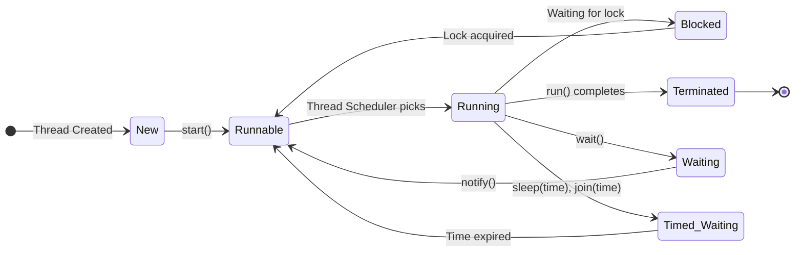

#### **What is a Process?**

- A **process** is an independent execution unit that has its own memory space.
- It is an instance of a running program.
- Multiple processes do not share memory and communicate with each other using **Inter-Process Communication (IPC)** like sockets, files, or shared memory.
- A process can have multiple threads running inside it.

#### **What is a Thread?**

- A **thread** is a lightweight process that runs within a process.
- Threads in Java share the same memory space but have their own stack and registers.
- Threads allow parallel execution of tasks, improving application performance.

#### **Key Differences Between Process and Thread**

| Feature                  | Process                                                                | Thread                                                      |
| ------------------------ | ---------------------------------------------------------------------- | ----------------------------------------------------------- |
| **Definition**           | An independent execution unit with its own memory                      | A lightweight sub-task of a process                         |
| **Memory**               | Each process has its own memory space                                  | Threads share the same memory within a process              |
| **Communication**        | Uses IPC (Inter-Process Communication)                                 | Can communicate easily through shared memory                |
| **Execution Speed**      | Slower, as context switching between processes requires more resources | Faster, as context switching between threads is lightweight |
| **Creation**             | Takes more time due to memory allocation and context switching         | Faster, as threads share memory with their parent process   |
| **Dependency**           | Processes are independent                                              | Threads are dependent on the parent process                 |
| **Resource Consumption** | High, as each process needs its own memory and resources               | Low, as threads share resources                             |

#### **Example in Java**

Creating a thread in Java using `Thread` class:
```java
class MyThread extends Thread {
    public void run() {
        System.out.println("Thread is running...");
    }
    public static void main(String[] args) {
        MyThread t1 = new MyThread();
        t1.start();  // Start the thread
    }
}
```

Using `Runnable` interface:
```java
class MyRunnable implements Runnable {
    public void run() {
        System.out.println("Thread is running...");
    }
    public static void main(String[] args) {
        Thread t1 = new Thread(new MyRunnable());
        t1.start();
    }
}
```

Using `lambda Expression`:
```java
Thread thread = new Thread(() -> {
	System.out.println("Thread is running");
});
```

## **Java Thread Lifecycle**
The `Thread.State` enumeration defines the following states:

| **State**         | **Description**                                                      |
| ----------------- | -------------------------------------------------------------------- |
| **NEW**           | Thread is created but not started (`start()` not called).            |
| **RUNNABLE**      | Thread is ready to run but waiting for CPU time.                     |
| **BLOCKED**       | Thread is waiting to acquire a lock.                                 |
| **WAITING**       | Thread is waiting indefinitely for another thread (`wait()`).        |
| **TIMED_WAITING** | Thread is waiting for a specific time (`sleep(time)`, `join(time)`). |
| **TERMINATED**    | Thread has finished execution or stopped.                            |




A Java thread goes through the following five stages:

1. **New (Created)**
   - When a thread is created but not yet started.
   - State: `NEW`
   - Example:
     ```java
     Thread t = new Thread(() -> System.out.println("Thread Running"));
     ```
     At this point, the thread is not running yet.

2. **Runnable**
   - When the `start()` method is called, the thread is ready to run but waiting for CPU time.
   - The thread scheduler decides when it will run.
   - State: `RUNNABLE`
   - Example:
     ```java
     t.start(); // Thread is now runnable
     ```

3. **Running**
   - When the thread gets CPU time and starts executing the `run()` method.
   - State: Still `RUNNABLE` but actively running.
   - Example:
     ```java
     public void run() {
         System.out.println("Thread is running...");
     }
     ```

4. **Blocked / Waiting / Timed Waiting**
   - **Blocked:** When a thread is waiting to enter a synchronized block/method because another thread is holding the lock.
   - **Waiting:** When a thread is waiting indefinitely for another thread to perform a specific action (`wait()`).
   - **Timed Waiting:** When a thread is waiting for a certain period (e.g., using `sleep()` or `join(time)`).
   - States: `BLOCKED`, `WAITING`, `TIMED_WAITING`
   - Example:
     ```java
     synchronized(obj) { // Another thread has locked this object
         obj.wait(); // Thread is now in WAITING state
     }
     ```

5. **Terminated (Dead)**
   - When the thread completes execution or is stopped.
   - State: `TERMINATED`
   - Example:
     ```java
     System.out.println("Thread execution completed.");
     ```